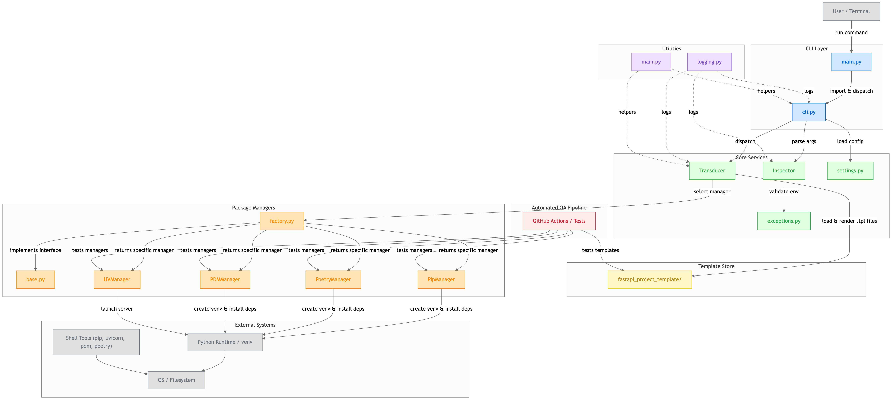

# CONTRIBUTING of FastAPI-fastkit

It is highly desirable to improve the project to provide better access for users who are new to Python and FastAPI.

Highly appreciate it for your interesting in this project and for your contribution by investing your precious time.

Before contributing to this open source, I strongly recommend that you read the
[SECURITY.md](SECURITY.md) and [CODE_OF_CONDUCT.md](CODE_OF_CONDUCT.md) files to understand
the direction of this project and the precautions for cooperation.

### Milestone of FastAPI-fastkit

Before get started, you'd better take a look at [MILESTONE](https://github.com/bnbong/FastAPI-fastkit/discussions/2) of this project.

To provide good productivity and quality service, I opened the source code for this project, but the direction of the project must be properly and firmly to provide a good user experience, leaving a milestone for the project officially.

This document will also be a good indicator for you to gain insight into the direction of this project's contribution.

## Setting up development environment

FastAPI-fastkit uses following stacks:

- Python 3.12+
- click 8.1.7+
- rich 13.9.2+
- pre-commit
- pytest for testing
- black for code formatting
- isort for import sorting
- mypy for static type checking

### Current Source Structure (Version 1.X.X+)



### Quick Setup with Makefile

The easiest way to set up your development environment is using our Makefile:

1. Clone repository:

```bash
git clone https://github.com/bnbong/FastAPI-fastkit.git
cd FastAPI-fastkit
```

2. Set up complete development environment:

```bash
make dev-setup
```

This single command will:
- Upgrade pip to the latest version
- Install the package in development mode with all dev dependencies
- Install documentation dependencies
- Set up pre-commit hooks
- Create a ready-to-use development environment

### Manual Setup (Alternative)

If you prefer manual setup or need more control:

1. Create and activate virtual environment:

```bash
python -m venv .venv
source .venv/bin/activate # for Windows, use: .venv\Scripts\activate
```

2. Install development dependencies:

```bash
make install-dev
```

### Available Development Commands

Use `make help` to see all available development commands:

```bash
make help
```

Key commands for contributors:

#### Development Workflow
- `make dev-setup` - Complete development environment setup
- `make dev-check` - Run all development checks (format, lint, test)
- `make dev-fix` - Fix formatting and run tests
- `make quick-test` - Quick test after code changes

#### Code Quality
- `make format` - Format code using black and isort
- `make format-check` - Check code formatting without making changes
- `make lint` - Run all linting checks (isort, black, mypy)

#### Testing
- `make test` - Run all tests
- `make test-verbose` - Run tests with verbose output
- `make test-coverage` - Run tests with coverage report
- `make coverage-report` - Generate detailed coverage report (supports FORMAT=html/xml/json/all)

#### Installation and Building
- `make install-test` - Install package for testing (uninstall + reinstall)
- `make clean` - Clean build artifacts and cache files
- `make build` - Build the package

#### Documentation
- `make build-docs` - Build documentation
- `make serve-docs` - Serve documentation locally

#### Translation
- `make translate` - Translate documentation (supports LANG, PROVIDER, MODEL parameters)

### Development Workflow

1. **Before making changes:**
   ```bash
   make dev-setup  # First time only
   make dev-check  # Ensure everything is working
   ```

2. **During development:**
   ```bash
   make quick-test  # After making changes
   ```

3. **Before committing:**
   ```bash
   make dev-check  # Final verification
   ```

### Linting & Formatting

Code quality is maintained using these tools:

1. **Black**: Code formatting
   ```bash
   make format
   ```

2. **isort**: Import sorting (integrated with black profile)
   ```bash
   # Included in make format
   ```

3. **mypy**: Static type checking
   ```bash
   make lint
   ```

4. **All checks together**:
   ```bash
   make dev-check
   ```

### Testing

Run tests using these commands:

1. **Basic test run:**
   ```bash
   make test
   ```

2. **Verbose output:**
   ```bash
   make test-verbose
   ```

3. **Coverage report:**
   ```bash
   make test-coverage
   ```

4. **Detailed coverage report with options:**
   ```bash
   make coverage-report              # Terminal output
   make coverage-report FORMAT=html  # HTML report (opens in browser)
   make coverage-report FORMAT=all   # All formats (term, html, xml, json)
   ```

### Making PRs

Use these tags in PR title:

- [FEAT]: New feature
- [FIX]: Bug fix
- [DOCS]: Documentation changes
- [STYLE]: Code formatting
- [TEST]: Test code
- [REFACTOR]: Code refactoring
- [CHORE]: Build, config changes

Example:

```bash
# PR title example 1
'[FEAT] Add new FastAPI template for microservices'

# PR title example 2
'[FIX] Fix virtual environment activation in Windows'
```

#### Pre-commit

Pre-commit hooks are automatically installed with `make dev-setup`. The hooks will run automatically when you commit and include:

- Code formatting (black, isort)
- Linting checks
- Type checking (mypy)

If pre-commit finds issues, fix them and commit again:

```bash
make dev-fix  # Fix common issues
git add .
git commit -m "Your commit message"
```

## Documentation

Follow these documentation guidelines:

1. Docstring for all functions/classes (not necessary, but recommended)
2. Except for translations and typographical corrections, modifications to the core [README.md](README.md), [SECURITY.md](SECURITY.md), [CONTRIBUTING.md](CONTRIBUTING.md), [CODE_OF_CONDUCT.md](CODE_OF_CONDUCT.md) files of the FastAPI-fastkit project itself are prohibited.

## Adding new FastAPI-based template project

When adding a new FastAPI template project, follow these guidelines:

### Template Structure Requirements

1. Directory Structure:

```
template-name/
├── src/
│ ├── main.py-tpl
│ ├── config/
│ ├── models/
│ ├── routes/
│ └── utils/
├── tests/
├── scripts/
├── requirements.txt-tpl
├── setup.py-tpl
└── README.md-tpl
```

2. File Extensions:
   - All Python source files must use `.py-tpl` extension
   - Template files must include proper configuration files (.env-tpl, etc.)

3. Dependencies:
   - Include `fastapi-fastkit` in setup.py
   - Specify version numbers in requirements.txt
   - Use latest stable versions of dependencies

### Security Requirements

1. Implementation Requirements:
   - Environment variables management (.env)
   - Basic authentication system
   - CORS configuration
   - Exception handling and logging

2. Security Checks:
   - All template code must pass `inspector.py` validation
   - Include security middleware configurations
   - Follow security guidelines in SECURITY.md

### Documentation

1. README.md Requirements:
   - Use PROJECT_README_TEMPLATE.md format
   - Include comprehensive setup instructions
   - Document all environment variables
   - List all major dependencies
   - Provide API documentation

2. Code Documentation:
   - Include docstrings for all functions/classes
   - Document API endpoints
   - Include example usage (not necessary, but recommended)
   - Provide configuration explanations

### Testing

FastAPI-fastkit includes **automated template testing** that provides comprehensive validation:

#### ✅ CI/CD Template Inspection

When you submit a PR that modifies template files, the **Template PR Inspection** workflow automatically runs:

- 🔍 **Automatic Trigger**: Runs when files in `src/fastapi_fastkit/fastapi_project_template/` are modified
- ✅ **Validation**: Inspects changed templates using `inspect-changed-templates.py`
- 💬 **PR Feedback**: Posts success/failure comments directly on your PR

Additionally, a **Weekly Template Inspection** runs every Wednesday to validate all templates.

#### ✅ Automatic Template Testing

**Zero Configuration Required:**
- 🚀 New templates are **automatically discovered** and tested
- ⚡ No manual test file creation needed
- 🛡️ Consistent quality standards applied

**Comprehensive Test Coverage:**
- ✅ **Project Creation**: Template copying and metadata injection
- ✅ **Package Manager Support**: UV, PDM, Poetry, and PIP compatibility
- ✅ **Virtual Environment**: Creation and dependency installation
- ✅ **Project Structure**: File and directory validation
- ✅ **FastAPI Integration**: Project identification and functionality

**Test Execution:**
```bash
# Test all templates automatically
$ pytest tests/test_templates/test_all_templates.py -v

# Test your specific template
$ pytest tests/test_templates/test_all_templates.py::TestAllTemplates::test_template_creation[your-template-name] -v

# Test with PDM environment
$ pdm run pytest tests/test_templates/test_all_templates.py -v
```

#### ✅ Template-Specific Testing

While basic functionality is automatically tested, you should include template-specific tests:

1. **Required Template Tests:**
   - Basic CRUD operations (if applicable)
   - Authentication/Authorization (if implemented)
   - Error handling
   - API endpoints
   - Configuration validation

2. **Test Coverage Goals:**
   - Minimum 80% code coverage for template-specific logic
   - Include integration tests for external services
   - API testing examples in template documentation

#### ✅ Package Manager Testing

Test your template with all supported package managers:

```bash
# Test with different package managers
$ fastkit startdemo your-template-name --package-manager uv
$ fastkit startdemo your-template-name --package-manager pdm
$ fastkit startdemo your-template-name --package-manager poetry
$ fastkit startdemo your-template-name --package-manager pip
```

### Submission Process

1. **Initial Setup:**
   ```bash
   git clone https://github.com/bnbong/FastAPI-fastkit.git
   cd FastAPI-fastkit
   make dev-setup
   ```

2. **Development:**
   ```bash
   # Create new branch
   git checkout -b feature/new-template-name

   # Implement your template
   # ...

   # Run development checks
   make dev-check
   ```

3. **Pre-submission Checklist:**
   ```bash
   make dev-check  # Must pass all checks
   ```
   - [ ] All files use .py-tpl extension
   - [ ] FastAPI-fastkit dependency included
   - [ ] Security requirements met
   - [ ] Documentation complete
   - [ ] inspector.py validation passes
   - [ ] All make dev-check tests pass
   - [ ] **Automatic template tests pass** (new templates tested automatically)
   - [ ] **Package manager compatibility verified** (tested with UV, PDM, Poetry, PIP)
   - [ ] **Template-specific functionality tested** (if applicable)

4. **Pull Request:**
   - Provide detailed description
   - Include test results from `make test-coverage`
   - Document any special requirements
   - Reference related issues

<br>

For more detailed information about security requirements and project guidelines, please refer to:
- [SECURITY.md](SECURITY.md) for security guidelines
- [CODE_OF_CONDUCT.md](CODE_OF_CONDUCT.md) for project principles

## Contributing Translations

FastAPI-fastkit documentation supports multiple languages. Contributing translations helps users worldwide.

### Supported Languages

- 🇬🇧 English (en) - Default
- 🇰🇷 Korean (ko)
- 🇯🇵 Japanese (ja)
- 🇨🇳 Chinese (zh)
- 🇪🇸 Spanish (es)
- 🇫🇷 French (fr)
- 🇩🇪 German (de)

### Translation Setup

#### 1. Install Dependencies

```bash
pdm install -G docs -G translation
# Or: pip install mkdocs mkdocs-material mkdocs-static-i18n openai anthropic
```

#### 2. Set Up API Key

Get an API key from OpenAI or Anthropic and set it as an environment variable:

```bash
export TRANSLATION_API_KEY="your-api-key-here"
```

#### 3. First-Time Setup (Maintainers Only)

If this is the first time setting up the i18n structure:

```bash
./scripts/setup-i18n-structure.sh
```

This migrates existing English docs to `docs/en/` and creates language directories.

### Translating Documentation

#### Using Make Commands (Recommended)

```bash
# Translate all docs to all configured languages
make translate

# Translate to specific language
make translate LANG=ko

# Specify API provider and model
make translate LANG=ko PROVIDER=github MODEL=gpt-4o-mini
make translate LANG=ko PROVIDER=openai MODEL=gpt-4
```

#### Using Script Directly

```bash
# Translate all docs to Korean
python scripts/translate.py --target-lang ko --api-provider openai

# Translate specific files (paths relative to docs/en/)
python scripts/translate.py --target-lang ko --files index.md user-guide/installation.md --api-provider openai

# Translate without creating PR (for local testing)
python scripts/translate.py --target-lang ko --no-pr --api-provider openai
```

#### Using GitHub Actions

1. Go to repository → Actions → "Translate Documentation"
2. Click "Run workflow"
3. Select target language and options
4. Wait for automated PR to be created
5. Review and merge the translation

### Translation Workflow

1. **Write English documentation** in `docs/en/`
2. **Test locally**: `mkdocs serve`
3. **Commit English version** to main branch
4. **Run translation script** or trigger GitHub Actions
5. **Review PR**: Check formatting, technical terms, links
6. **Merge** and deploy

### Translation Quality Guidelines

When reviewing translations:

- ✅ Markdown formatting is preserved
- ✅ Code blocks are unchanged
- ✅ Technical terms are appropriate
- ✅ Links work correctly
- ✅ Grammar and spelling are correct

### Manual Translation

You can also translate manually:

1. Copy file from `docs/en/` to `docs/{lang}/`
2. Translate the content
3. Create PR with `[DOCS]` tag

### Adding New Languages

To add support for a new language:

1. **Update `scripts/translation_config.json`**:
```json
{
  "code": "pt",
  "name": "Portuguese",
  "native_name": "Português",
  "enabled": true
}
```

2. **Update `mkdocs.yml`**:
```yaml
- locale: pt
  name: Português
  build: true
```

3. **Run translation**:
```bash
python scripts/translate.py --target-lang pt
```

### Translation System Architecture

**Core Components:**

- **`scripts/translate.py`**: AI-powered translation script
  - Supports OpenAI GPT-4 and Anthropic Claude
  - Preserves markdown formatting and code blocks
  - Creates GitHub PRs automatically

- **`scripts/setup-i18n-structure.sh`**: Migration tool
  - Moves docs to language-specific directories
  - Creates symbolic links for shared assets

- **`scripts/translation_config.json`**: Configuration
  - Language settings
  - Translation options
  - Quality check parameters

- **`.github/workflows/translate-docs.yml`**: GitHub Actions workflow
  - Automated translation on trigger
  - Manual workflow dispatch

**Directory Structure:**

```
docs/
├── en/                    # English (source)
├── ko/                    # Korean
├── ja/                    # Japanese
├── zh/                    # Chinese
├── es/                    # Spanish
├── fr/                    # French
├── de/                    # German
├── css/                   # Shared assets
├── js/
└── img/
```

### Troubleshooting

**Import Error:**
```bash
pip install openai anthropic
```

**API Key Error:**
```bash
export TRANSLATION_API_KEY="your-key"
```

**Build Fails:**
```bash
# Ensure docs are in language directories
ls -la docs/en/index.md
```

For detailed translation guidelines, see [Translation Guide](docs/en/contributing/translation-guide.md).

### Updating Navigation Translations

When you add new documentation pages, update navigation translations:

**Option 1: Automatic Update (Recommended)**

```bash
# Update all language nav translations automatically
python scripts/update_nav_translations.py

# With AI translation for missing items
python scripts/update_nav_translations.py --api-key "your-key"
```

**Option 2: Manual Update**

Edit `mkdocs.yml` and add translations for each language under `nav_translations`:

```yaml
- locale: ko
  nav_translations:
    New Page Title: 새로운 페이지 제목
```

**Note:** Korean translations should be kept complete. Other languages use basic translations (Home, User Guide, Tutorial, etc.). Native speakers can contribute more detailed translations via PR.

## Additional note

If you look at source codes, you will see a commentary at the top of the module that describes about the module.

In that section, I have my information as the manager of this project as author, but that doesn't mean I'm the only one who can modify the module.

I emphasize that the reason I left my information in the comment section is to specify the information about the project's final director and not to increase the barriers to entry into the open source contribution of other contributors.

**However**, I would like to inform you that I have only the right to modify the document file content itself of FastAPI-fastkit project's core documents (README.md, SECURITY.md, CODE_OF_CONDUCT.md, CONTRIBUTING.md) file.

If the contribution to the project includes the document contribution except translation and typographical corrections, there is a possibility that PR will be rejected.

---
@author bnbong bbbong9@gmail.com
