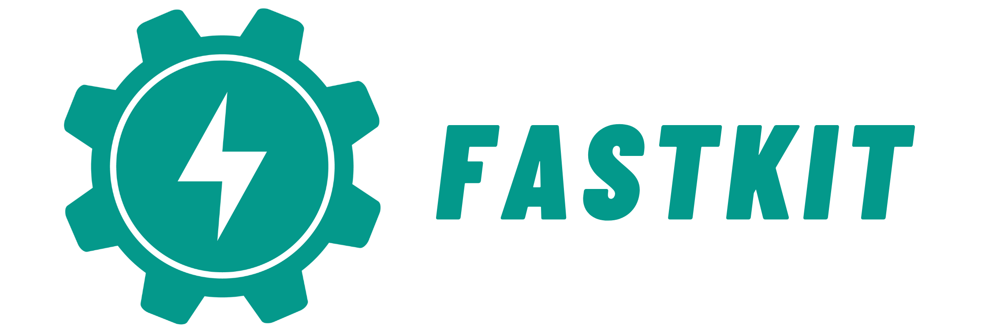

    

<em><b>FastAPI-fastkit</b>: Fast, easy-to-use starter kit for new users of Python and FastAPI</em>

---

This project was created to speed up the configuration of the development environment needed to develop Python-based web apps for new users of Python and [FastAPI](https://github.com/fastapi/fastapi).

This project was inspired by the `SpringBoot initializer` of the JAVA ecosystem & Python Django's `django-admin` cli operation.

---

(other content will be updated later)

---
@author bnbong bbbong9@gmail.com
